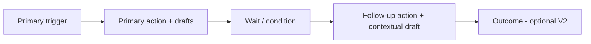

# Workflow follow-up builder — feasibility & implementation plan

**Status:** Draft (2026-05-20)  
**Scope:** V1.5 extension — primary trigger + action (existing 5-step wizard) plus **one optional follow-up** leg (trigger + action).

### Design lock (Phase 0 — done)

| Decision | Locked value | Code |
|----------|--------------|------|
| Max follow-up legs | 1 | `WORKFLOW_FOLLOW_UP_V15.maxFollowUpLegs` |
| Follow-up action kinds | `send_email` only | `allowedFollowUpActionKinds` |
| Follow-up triggers | `wait` + `no_reply`, `on_inbound_reply` + `any_reply` | `workflowFollowUpTriggerSchema` |
| Per-LP follow-up personalise | Off | `followUpPersonalisePerLp: false` |
| Wait bounds | 1–90 days (default 7) | `minWaitDays` / `maxWaitDays` / `defaultWaitDays` |
| Step IDs | `{id}-trigger`, `-primary`, `-wait`, `-follow-up` | `workflowCustomStepIds()` |
| Storage field | `CustomPlaybookStored.followUp?: WorkflowLeg` | `custom-playbook-schema.ts` |

Implementation: `src/lib/workflow-follow-up-design.ts`, tests in `workflow-follow-up-design.test.ts`.

---

## Summary

Extend the custom workflow builder so users can define a **follow-up** after the primary action:

1. **Follow-up trigger** — typically `wait {X} days` when LP has not replied, or **immediate** when an inbound LP email is received.
2. **Follow-up action** — Tomo drafts a contextual response from templates built during the primary leg.
3. **Reuse** existing attribution, cohort launch, and outcome/metrics display infrastructure.

Entry points:

- End of wizard **step 5 (Personalise)** — “Add follow-up” vs “Save & finish”.
- **Edit action** CTA on an **inactive** custom workflow (same sub-wizard for primary or follow-up).

**Verdict:** Feasible for V1.5. Does **not** fully replicate all four surface mock workflows in one pass; closest match is **Themed Outreach** (primary → wait → follow-up nudge).

---

## Current V1 baseline

| Layer | Today |
|-------|--------|
| **Authoring** | 5-step wizard: Name → Trigger → Action → Draft → Personalise (`WORKFLOW_CREATE_STEPS`) |
| **Saved shape** | One launch trigger + one primary action (`CustomPlaybookStored`, `actionBuild`) |
| **Runtime (mock)** | `workflow_runs` / `workflow_step_runs`, cohort launch, `record-send`, `attribute-reply` |
| **UI (inactive)** | Editable via “Edit action” → reopens wizard |
| **UI (active)** | Monitor-only; structure locked |

Reference: `src/lib/workflow-create-draft.ts`, `src/components/workflow-build-modal.tsx`, `src/lib/custom-playbook-schema.ts`, `src/lib/workflow-runs.ts`.

---

## Target graph (one follow-up leg)



---

## Feasibility

### What already exists

| Capability | Location |
|------------|----------|
| Multi-step **display** (wait + follow-up nodes) | `workflowSurfaceEntries` — Themed, Trip, F7 |
| Per-step **draft templates** | `WorkflowActionBuildConfig` on primary |
| **Attribution** (thread / In-Reply-To) | `attributeInboundReply`, `/api/workflows/attribute-reply` |
| **Outbound tagging** | `/api/workflows/record-send`, `applyOutboundWorkflowTag` |
| **State / metrics UI** | `stateSummary.segments`, step monitor drawer |
| **DB shape** | `workflow_runs`, `workflow_step_runs` (`db/migrations/20260520120000_workflow_runs_cohort_launch.sql`) |

### Gaps

| Gap | Notes |
|-----|--------|
| Custom builder graph | Only trigger + 1 action in `customPlaybookToSurfaceEntry` |
| Follow-up storage | No `followUp` on `CustomPlaybookStored` |
| Step advancement | Launch creates one initial `workflow_step_run`; no wait timer / advance-on-reply |
| `workflow_steps` table | Not migrated yet; definitions live in localStorage / mock DTO |

### Mock workflow parity

| Mock workflow | Achievable with primary + 1 follow-up? | Notes |
|---------------|----------------------------------------|--------|
| **Themed Outreach** | **Yes (closest)** | Themed batch → 7d wait / no reply → follow-up nudge |
| **Trip Orchestrator** | Partial | Outreach + follow-up yes; scheduling reply leg is separate |
| **Post-Meeting Execution** | Partial | Event + capture form ≠ email wait; follow-up draft fits second action only |
| **F7 Three-Touch** | No | 3 touches + 2 waits → V2 multi-leg or N follow-up segments |

**End state for this plan:** Users can build **Themed-style** workflows (and simple Trip-style nudges) from scratch, not full F7 or post-meeting capture flows.

---

## Reusing wizard steps 2–4

Keep **step 1 (Name)** global. Model **primary** and **follow-up** as two **legs**, each using a shared sub-wizard:

| Leg step | Primary (today) | Follow-up (new) |
|----------|-----------------|-----------------|
| Trigger | Step 2 — Tomo chat | **Constrained:** `wait` (days + `no_reply`) or `on_inbound_reply` |
| Action | Step 3 — instruction + pills | Same; prompt references primary `actionBuild` |
| Draft | Step 4 — cohort + base template | Same API; “contextual follow-up from primary template” |
| Personalise | Step 5 — per-LP | Optional for follow-up; recommend **base-only** in v1 ship |

**Implementation:** Extract `WorkflowLegWizard` from `WorkflowBuildModal`, parameterized by `leg: "primary" | "followUp"` and `triggerMode: "launch" | "followUp"`.

---

## Data model (minimal)

```ts
type WorkflowFollowUpTrigger =
  | { kind: "wait"; days: number; condition: "no_reply" }
  | { kind: "on_inbound_reply"; condition?: "any_reply" | "meaningful_reply" };

type WorkflowLeg = {
  trigger: string; // human summary for cards
  triggerSpec?: WorkflowFollowUpTrigger; // follow-up only; primary uses launch trigger
  actionBuild: WorkflowActionBuildConfig;
  actionSpec?: UserWorkflowAction;
};

// CustomPlaybookStored (evolved)
{
  id: string;
  name: string;
  // Primary — keep flat fields for backward compat OR nest under primary:
  trigger: string;
  action: string;
  actionSpec?: UserWorkflowAction;
  actionBuild?: WorkflowActionBuildConfig;
  followUp?: WorkflowLeg;
  createdAt: string;
}
```

**Stable step IDs** (for runs / attribution):

- `{workflowId}-trigger`
- `{workflowId}-primary`
- `{workflowId}-wait` (display node; may not have its own step run)
- `{workflowId}-follow-up`

**Surface mapping** (`customPlaybookToSurfaceEntry`): when `followUp` is set, emit nodes like Themed Outreach and two `stateSummary.segments` (Primary action, Follow-up).

---

## Runtime & attribution

Reuse existing primitives; add a small orchestration module (e.g. `workflow-run-advance.ts`):

| Event | Behavior |
|-------|----------|
| Launch | `buildCohortLaunch` with `initialWorkflowStepId` = primary action only |
| Primary `record-send` | Tag outbound; mark primary step run `sent` |
| Wait elapsed + `no_reply` | Create follow-up step run `pending` → draft batch |
| Inbound reply before wait | Skip wait-based follow-up if condition is `no_reply` only |
| `on_inbound_reply` trigger | On attributed reply to primary, enqueue follow-up step run |
| Follow-up `record-send` | Same tagging; second step id in attribution chain |

**Metrics:** Derive `stateSummary.segments` from `workflow_step_runs` grouped by `workflowStepId`. Step monitor drawer unchanged — pass follow-up step node like `themed-follow-up`.

**Mock wait scheduler:** Advance on read if `sentAt + days < now`; production needs cron/worker.

---

## Entry points

1. **Step 5 footer** — `Save & finish` | `Add follow-up` (opens follow-up leg sub-wizard).
2. **Edit action** (inactive only) — section switcher **Primary** | **Follow-up**; same sub-wizard. Activated workflows remain read-only.

---

## Implementation phases

### Phase 0 — Design lock (~0.5d) ✅

- [x] One optional follow-up; email / `send_email` only for first ship.
- [x] Triggers: `wait + no_reply` | `on_inbound_reply` (defer “meaningful reply” NLP).
- [x] Follow-up personalise: off for v1 unless explicitly in scope.

### Phase 1 — Schema + leg wizard refactor (2–3d) ✅

- [x] Add `WorkflowLeg`, `WorkflowFollowUpTrigger`, `followUp?` on `CustomPlaybookStored` (types + validation).
- [x] Legacy migration — `migratePartialFollowUpLegs` / `migrateCustomPlaybooksList` in `customPlaybooks.ts`.
- [x] Extract `WorkflowLegWizard` — `src/components/workflow-leg-wizard.tsx` + `src/lib/workflow-leg-draft.ts`.
- [x] Step 5: **Add follow-up** / **Save & finish** (`data-testid="workflow-add-follow-up"`).
- [x] Edit flow: **Primary** | **Follow-up** tabs when inactive (`data-testid="workflow-build-edit-sections"`).

### Phase 2 — Surface + process diagram (1–2d) ✅

- [x] Update `workflowDefinitionFromCustomStored` / `customPlaybookToSurfaceEntry` (4 nodes with wait follow-up; 3 with on-reply).
- [x] Wait node `timingLabel` from `days` (`followUpWaitTimingLabel` → e.g. `7d`).
- [x] Banner copy for primary-only vs primary + follow-up (`workflow-expanded-body.tsx`).

### Phase 3 — Launch + step runs (2–3d)

- [ ] Launch API: primary step run at launch; follow-up step definition registered.
- [ ] `resolveInitialWorkflowStepId` → primary only.

### Phase 4 — Advancement + attribution (2–3d)

- [ ] `advanceWorkflowRunOnSend`, `advanceWorkflowRunOnReply`, `advanceWorkflowRunOnWaitElapsed`.
- [ ] Tests: no_reply path, early reply skips follow-up, on_reply enqueues follow-up.
- [ ] Document ingest hook for `attribute-reply`.

### Phase 5 — Follow-up draft generation (1–2d)

- [ ] Extend or sibling route to `generate-workflow-cohort-draft`: primary template + follow-up instruction → contextual drafts.

### Phase 6 — Activated monitoring (1d)

- [ ] Active: monitor both segments; step drawer on follow-up step.
- [ ] Optional attention: “Follow-up drafts ready” when wait elapses.

**Estimate:** ~10–14 dev days for shippable V1.5. Multi-touch (F7), Trip scheduling leg, outcome capture in builder: +8–15d (V2).

---

## Risks & mitigations

| Risk | Mitigation |
|------|------------|
| No production wait scheduler | Mock time check on read; single worker in prod |
| Edit after launch | Keep no edit when activated |
| Expectation of full mock parity | Document V2 multi-leg; ship Themed path first |
| Wizard duplication | Single `WorkflowLegWizard`; do not fork two modals |

---

## Deferred (V2+)

- Per-LP follow-up personalise
- Second+ follow-up legs / F7 three-touch builder
- Trip **scheduling reply handling** as a dedicated leg
- Post-meeting **capture form** trigger type
- Outcome capture node in custom builder
- `workflow_steps` DB table + server-side definition API

---

## Related docs

- `docs/WORKFLOW_SURFACE_API_MAPPING_2026-05-17.md` — DTO ↔ tables
- `docs/WORKFLOW_CREATOR_ORCHESTRATOR_PLAN.md` — original custom workflow creator
- `src/lib/workflow-runs.ts` — cohort launch & attribution
- `src/lib/workflow-surface-mock.ts` — Themed / Trip reference graphs
